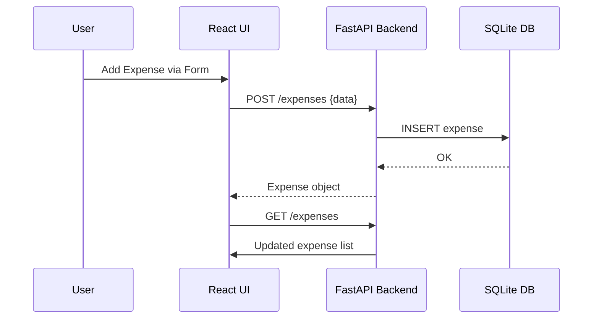

# Expense Tracker – Application Documentation

## Overview

Expense Tracker is a simple web application that enables users to add, view, and delete their expenses. Each expense item includes a description, the amount spent, and the date. The application displays all recorded expenses in a list alongside the total amount spent. It is designed for ease of use, does **not require user authentication**, and maintains a modern, responsive single-page layout.

---

## Architecture

The Expense Tracker app utilizes a **modern three-tier architecture**:
- **Frontend**: React single-page app.
- **Backend**: FastAPI (Python) REST API.
- **Database**: SQLite (file-based relational store).

The architecture provides clear separation of concerns—UI logic resides in the frontend, API and business logic in the backend, and persistence in the database.

```mermaid
flowchart TD
    subgraph Frontend [React Frontend (Port 3000)]
        FE[Expense Tracker UI]
    end
    subgraph Backend [FastAPI Backend (Port 3001)]
        BE[Expense API (CRUD, Totals)]
    end
    subgraph DB [SQLite DB (Port 5001)]
        DBFile[(expenses.db)]
    end

    FE-->|REST API (CRUD ops)|BE
    BE-->|SQL Query (CRUD)|DBFile
```

---

## Containers and Responsibilities

| Container              | Type      | Framework | Port  | Description                                                     |
|------------------------|-----------|-----------|-------|-----------------------------------------------------------------|
| expense_tracker_frontend| Frontend  | React     | 3000  | User interface; form to add expense, list, total display        |
| expense_tracker_backend | Backend   | FastAPI   | 3001  | REST API for expenses (add, delete, list, compute total)        |
| database               | Database  | SQLite    | 5001* | Stores expense data locally as a `.db` file                     |

\* Port 5001 is illustrative (SQLite is local file; the port applies if using e.g. a management shell).

---

## Feature List

- Add a new expense (description, amount, date)
- View all expenses as a list (sorted by date)
- Delete an expense entry
- Display running total of all expenses
- (Optional) Basic input validation (amount > 0, required fields)

---

## Data Model

**Expense Object**

| Field       | Type     | Example         | Notes                |
|-------------|----------|-----------------|----------------------|
| id          | integer  | 1               | Unique, auto-increment|
| description | string   | "Lunch"         | Required             |
| amount      | float    | 8.50            | Required, >0         |
| date        | string   | "2024-06-26"    | ISO format, required |

**Database Table (expenses)**
```sql
CREATE TABLE expenses (
    id INTEGER PRIMARY KEY AUTOINCREMENT,
    description TEXT NOT NULL,
    amount REAL NOT NULL CHECK(amount > 0),
    date TEXT NOT NULL
)
```

---

## REST API Endpoints

| Method | Path         | Purpose                           | Request Body          | Response           |
|--------|--------------|-----------------------------------|----------------------|--------------------|
| GET    | `/expenses`  | List all expenses                 | —                    | `[Expense]`        |
| POST   | `/expenses`  | Add a new expense                 | `{description,amount,date}` | Added Expense    |
| DELETE | `/expenses/{id}` | Delete an expense by ID         | —                    | `{success: bool}`  |
| GET    | `/total`     | Fetch running total of expenses   | —                    | `{total: float}`   |
| GET    | `/`          | Health check                      | —                    | `{status: "OK"}`   |

**Sample API Request/Response:**
```http
POST /expenses
{
  "description": "Groceries",
  "amount": 70.25,
  "date": "2024-06-26"
}
→
{
  "id": 5,
  "description": "Groceries",
  "amount": 70.25,
  "date": "2024-06-26"
}
```

---

## Frontend UX and State Flow

The frontend is a React SPA built for responsiveness and clarity:

```
+-----------------------------+
| Add Expense Form            | ← User adds data
+-----------------------------+
| Expense List                | ← Data fetch from backend
|  [Expense 1]  [Delete]      |
|  [Expense 2]  [Delete]      |
|  ...                        |
+-----------------------------+
| Total Spent: $123.45        |
+-----------------------------+
```

### State Management & Flow

- Local React state holds the list of expenses and current form fields.
- On mount or update, the frontend fetches the current expenses and total from the backend.
- Expense add and delete actions make REST API calls, then refresh state on success.

**Frontend State Update Flow:**



---

## Backend Logic and Error Handling

- The FastAPI backend exposes endpoints for CRUD operations and total calculations.
- On each POST/DELETE, the backend writes data to SQLite and confirms results before responding.
- Error handling includes input validation (type, positive amount, non-empty values) and appropriate HTTP error codes (400 for bad input, 404 for missing ID).
- On DB error, backend returns generic error message.

---

## Database Schema and Migrations

- Uses a single table: `expenses`.
- Database file: typically `expenses.db`
- No migrations necessary for simple schema; evolving schema should be managed via standard SQL migration tools or manual statements.

---

## Configuration and Environment

- **Backend Config:**
  - Relies on direct file SQLite connection (no external environment variables by default).
  - Dependencies described in `requirements.txt`.
- **Frontend Config:**
  - REST API endpoint URL is hardcoded to `localhost:3001` in dev.
  - No secret data or environment variables needed.

---

## Local Development and Preview System

**Typical Developer Flow:**
1. Install backend dependencies:  
   `cd expense_tracker_backend && pip install -r requirements.txt`
2. Start SQLite database (if needed, file auto-created):  
   (No manual action required)
3. Run backend server:  
   `uvicorn src.api.main:app --host 0.0.0.0 --port 3001`
4. Install frontend dependencies:  
   `cd expense_tracker_frontend && npm install`
5. Start frontend dev server:  
   `npm start`
6. Open the app at [http://localhost:3000](http://localhost:3000)

---

## Security and Privacy Considerations

- No authentication is implemented (intended for personal/local use).
- All data is stored in a local SQLite file; no internet transmissions beyond frontend-backend localhost REST calls.
- Do **not** use this design for sensitive data without adding authentication, HTTPS, and access controls.

---

## Testing Strategy

- **Backend**: Unit tests for API routes and input validation (where present).
- **Frontend**: Component-level tests for UI logic and connections (with mocking of API).
- Use simple test runners: `pytest` (Python) and `npm test` (React).

---

## Future Enhancements

- Implement user authentication and individual expense tracking.
- Add categories/tags for expenses.
- Enhance validation and error handling (e.g., input masks, form UX).
- Export expenses as CSV or Excel.
- Responsive charts/analytics for spend breakdown.
- Move to persistent/shared DB for multi-user mode.

---

## Changelog

- v1 (2024-06): Initial version as described above.

---

## License

This project is open source for educational/demonstration purposes.

---

_Task completed: comprehensive application documentation for Expense Tracker covering overview, architecture, API, flow, and all requested dimensions._
